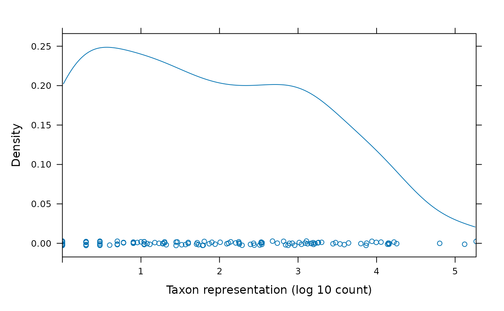
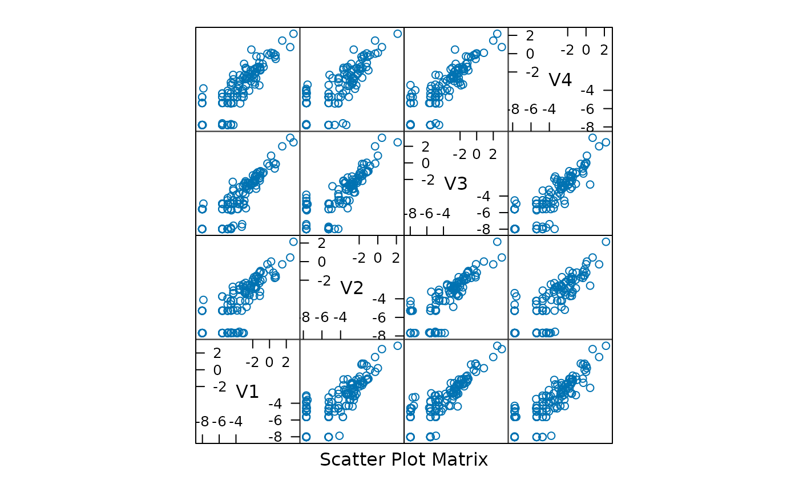
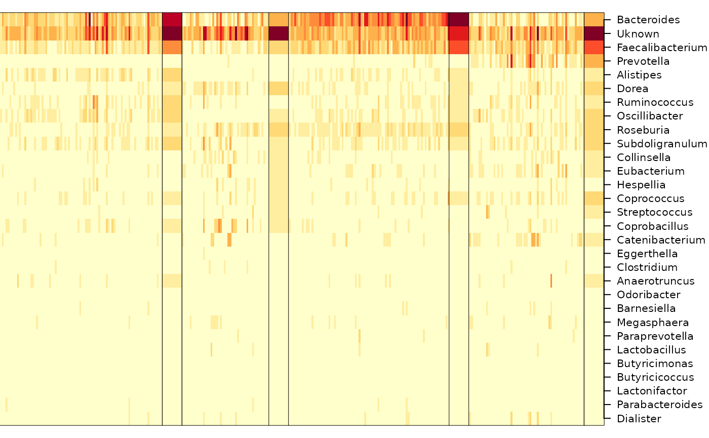
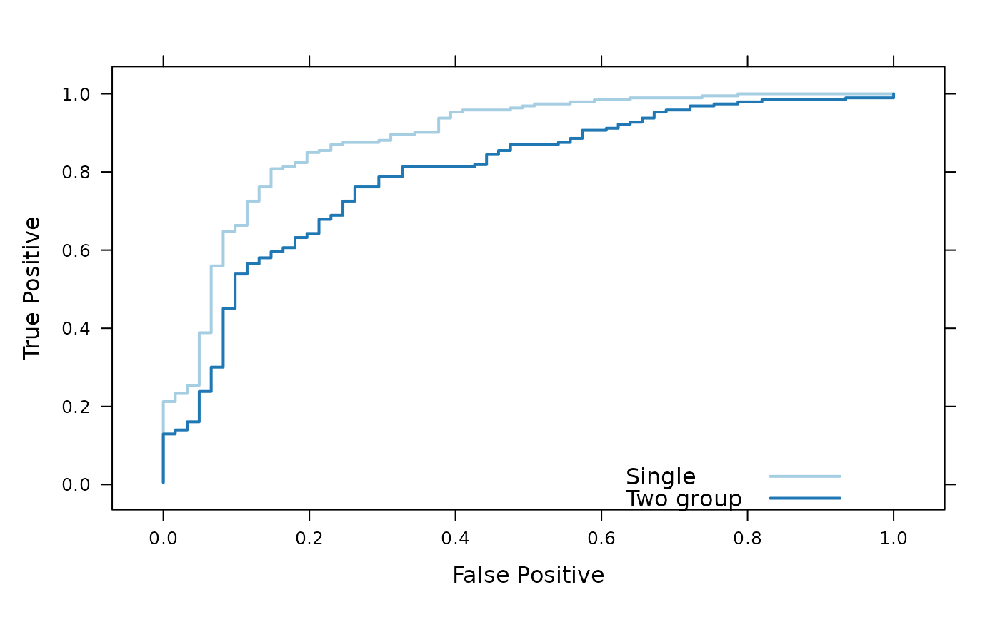

# DirichletMultinomial for Clustering and Classification of Microbiome Data

Modified: 6 March 2012, 19 October 2024 (HTML version)

This document illustrates the main features of the
*DirichletMultinomial* package, and in the process replicates key tables
and figures from Holmes et al.,
<https://doi.org/10.1371/journal.pone.0030126>.

We start by loading the package, in addition to the packages *lattice*
(for visualization) and *parallel* (for use of multiple cores during
cross-validation).

``` r

library(DirichletMultinomial)
library(lattice)
library(parallel)
```

We set the width of R output to 70 characters, and the number of
floating point digits displayed to two. The `full` flag is set to
`FALSE`, so that cached values are used instead of re-computing during
production of this vignette. The package defines a set of standard
colors; we use `.qualitative` during visualization.

``` r

options(width=70, digits=2)
full <- FALSE
.qualitative <- DirichletMultinomial:::.qualitative
```

## Data

The data used in Homes et al. is included in the package. We read the
data in to a matrix `count` of samples by taxa.

``` r

fl <- system.file(package="DirichletMultinomial", "extdata", "Twins.csv")
count <- t(as.matrix(read.csv(fl, row.names=1)))
count[1:5, 1:3]
#>         Acetanaerobacterium Acetivibrio Acetobacterium
#> TS1.2                     0           0              0
#> TS10.2                    0           0              0
#> TS100.2                   0           0              0
#> TS100                     1           0              0
#> TS101.2                   0           0              0
```

The figure below shows the distribution of reads from each taxon, on a
log scale.

``` r

cnts <- log10(colSums(count))
densityplot(
    cnts, xlim=range(cnts),
    xlab="Taxon representation (log 10 count)"
)
```



## Clustering

The `dmn` function fits a Dirichlet-Multinomial model, taking as input
the count data and a parameter $`k`$ representing the number of
Dirichlet components to model. Here we fit the count data to values of
$`k`$ from 1 to 7, displaying the result for $`k = 4`$. A sense of the
model return value is provided by the documentation for the R object
`fit`,
[`class ? DMN`](https://mtmorgan.github.io/DirichletMultinomial/reference/DMN-class.md).

``` r

if (full) {
    fit <- mclapply(1:7, dmn, count=count, verbose=TRUE)
    save(fit, file=file.path(tempdir(), "fit.rda"))
} else data(fit)
fit[[4]]
#> class: DMN 
#> k: 4 
#> samples x taxa: 278 x 130 
#> Laplace: 38781 BIC: 40425 AIC: 39477
```

The return value can be queried for measures of fit (Laplace, AIC, BIC);
these are plotted for different $`k`$ in The figure. The best fit is for
$`k=4`$ distinct Dirichlet components.

``` r

lplc <- sapply(fit, laplace)
plot(lplc, type="b", xlab="Number of Dirichlet Components", ylab="Model Fit")
```


``` r

(best <- fit[[which.min(lplc)]])
#> class: DMN 
#> k: 4 
#> samples x taxa: 278 x 130 
#> Laplace: 38781 BIC: 40425 AIC: 39477
```

In addition to `laplace` goodness of fit can be assessed with the `AIC`
and `BIC` functions.

The `mixturewt` function reports the weight $`\pi`$ and homogeneity
$`\theta`$ (large values are more homogeneous) of the fitted model.
`mixture` returns a matrix of sample x estimated Dirichlet components;
the argument `assign` returns a vector of length equal to the number of
samples indicating the component with maximum value.

``` r

mixturewt(best)
#>     pi theta
#> 1 0.31    52
#> 2 0.17    19
#> 3 0.30    53
#> 4 0.22    30
head(mixture(best), 3)
#>            [,1]    [,2]    [,3]    [,4]
#> TS1.2   1.0e+00 2.1e-11 8.6e-06 3.3e-08
#> TS10.2  3.8e-08 3.3e-04 1.0e+00 2.8e-10
#> TS100.2 7.2e-09 8.8e-01 8.0e-13 1.2e-01
```

The `fitted` function describes the contribution of each taxonomic group
(each point in the panels of the figure to the Dirichlet components; the
diagonal nature of the points in a panel suggest that the Dirichlet
components are correlated, perhaps reflecting overall numerical
abundance.

``` r

splom(log(fitted(best)))
```



The posterior mean difference between the best and single-component
Dirichlet multinomial model measures how each component differs from the
population average; the sum is a measure of total difference from the
mean.

``` r

p0 <- fitted(fit[[1]], scale=TRUE) # scale by theta
p4 <- fitted(best, scale=TRUE)
colnames(p4) <- paste("m", 1:4, sep="")
(meandiff <- colSums(abs(p4 - as.vector(p0))))
#>   m1   m2   m3   m4 
#> 0.26 0.47 0.51 0.34
sum(meandiff)
#> [1] 1.6
```

The table below summarizes taxonomic contributions to each Dirichlet
component.

``` r

diff <- rowSums(abs(p4 - as.vector(p0)))
o <- order(diff, decreasing=TRUE)
cdiff <- cumsum(diff[o]) / sum(diff)
df <- cbind(Mean=p0[o], p4[o,], diff=diff[o], cdiff)
DT::datatable(df) |>
    DT::formatRound(colnames(df), digits = 4)
```

The figure shows samples arranged by Dirichlet component, with samples
placed into the component for which they had the largest fitted value.

``` r

heatmapdmn(count, fit[[1]], best, 30)
```



## Generative classifier

The following reads in phenotypic information (‘Lean’, ‘Obese’,
‘Overweight’) for each sample.

``` r

fl <- system.file(package="DirichletMultinomial", "extdata", "TwinStudy.t")
pheno0 <- scan(fl)
lvls <- c("Lean", "Obese", "Overwt")
pheno <- factor(lvls[pheno0 + 1], levels=lvls)
names(pheno) <- rownames(count)
table(pheno)
#> pheno
#>   Lean  Obese Overwt 
#>     61    193     24
```

Here we subset the count data into sub-counts, one for each phenotype.
We retain only the Lean and Obese groups for subsequent analysis.

``` r

counts <- lapply(levels(pheno), csubset, count, pheno)
sapply(counts, dim)
#>      [,1] [,2] [,3]
#> [1,]   61  193   24
#> [2,]  130  130  130
keep <- c("Lean", "Obese")
count <- count[pheno %in% keep,]
pheno <- factor(pheno[pheno %in% keep], levels=keep)
```

The `dmngroup` function identifies the best (minimum Laplace score)
Dirichlet-multinomial model for each group.

``` r

if (full) {
    bestgrp <- dmngroup(
        count, pheno, k=1:5, verbose=TRUE, mc.preschedule=FALSE
    )
    save(bestgrp, file=file.path(tempdir(), "bestgrp.rda"))
} else data(bestgrp)
```

The Lean group is described by a model with one component, the Obese
group by a model with three components. Three of the four Dirichlet
components of the original single group (`best`) model are represented
in the Obese group, the other in the Lean group. The total Laplace score
of the two group model is less than of the single-group model,
indicating information gain from considering groups separately.

``` r

bestgrp
#> class: DMNGroup 
#> summary:
#>       k samples taxa   NLE LogDet Laplace   BIC   AIC
#> Lean  1      61  130  9066    162    9027  9333  9196
#> Obese 3     193  130 26770    407   26613 27801 27162
lapply(bestgrp, mixturewt)
#> $Lean
#>   pi theta
#> 1  1    35
#> 
#> $Obese
#>     pi theta
#> 1 0.53    45
#> 2 0.26    33
#> 3 0.22    18
c(
    sapply(bestgrp, laplace),
    'Lean+Obese' = sum(sapply(bestgrp, laplace)),
    Single = laplace(best)
)
#>       Lean      Obese Lean+Obese     Single 
#>       9027      26613      35641      38781
```

The `predict` function assigns samples to classes; the confusion matrix
shows that the classifier is moderately effective.

``` r

xtabs(~pheno + predict(bestgrp, count, assign=TRUE))
#>        predict(bestgrp, count, assign = TRUE)
#> pheno   Lean Obese
#>   Lean    38    23
#>   Obese   15   178
```

The `cvdmngroup` function performs cross-validation. This is a
computationally expensive step.

``` r

if (full) {
    ## full leave-one-out; expensive!
    xval <- cvdmngroup(
        nrow(count), count, c(Lean=1, Obese=3), pheno,
        verbose=TRUE, mc.preschedule=FALSE
    )
    save(xval, file=file.path(tempdir(), "xval.rda"))
} else data(xval)
```

The figure shows an ROC curve for the single and two-group classifier.
The single group classifier is performing better than the two-group
classifier.

``` r

bst <- roc(pheno[rownames(count)] == "Obese",
predict(bestgrp, count)[,"Obese"])
bst$Label <- "Single"
two <- roc(pheno[rownames(xval)] == "Obese", xval[,"Obese"])
two$Label <- "Two group"
both <- rbind(bst, two)
pars <- list(superpose.line=list(col=.qualitative[1:2], lwd=2))
xyplot(
    TruePostive ~ FalsePositive, group=Label, both,
    type="l", par.settings=pars,
    auto.key=list(lines=TRUE, points=FALSE, x=.6, y=.1),
    xlab="False Positive", ylab="True Positive"
)
```



``` r

sessionInfo()
#> R version 4.6.1 (2026-06-24)
#> Platform: x86_64-pc-linux-gnu
#> Running under: Ubuntu 24.04.5 LTS
#> 
#> Matrix products: default
#> BLAS:   /usr/lib/x86_64-linux-gnu/openblas-pthread/libblas.so.3 
#> LAPACK: /usr/lib/x86_64-linux-gnu/openblas-pthread/libopenblasp-r0.3.26.so;  LAPACK version 3.12.0
#> 
#> locale:
#>  [1] LC_CTYPE=C.UTF-8       LC_NUMERIC=C          
#>  [3] LC_TIME=C.UTF-8        LC_COLLATE=C.UTF-8    
#>  [5] LC_MONETARY=C.UTF-8    LC_MESSAGES=C.UTF-8   
#>  [7] LC_PAPER=C.UTF-8       LC_NAME=C             
#>  [9] LC_ADDRESS=C           LC_TELEPHONE=C        
#> [11] LC_MEASUREMENT=C.UTF-8 LC_IDENTIFICATION=C   
#> 
#> time zone: UTC
#> tzcode source: system (glibc)
#> 
#> attached base packages:
#> [1] parallel  stats4    stats     graphics  grDevices utils    
#> [7] datasets  methods   base     
#> 
#> other attached packages:
#> [1] lattice_0.22-9              DirichletMultinomial_1.55.0
#> [3] IRanges_2.46.0              S4Vectors_0.50.2           
#> [5] BiocGenerics_0.58.1         generics_0.1.4             
#> [7] BiocStyle_2.40.0           
#> 
#> loaded via a namespace (and not attached):
#>  [1] cli_3.6.6           knitr_1.52          rlang_1.3.0        
#>  [4] xfun_0.60           otel_0.2.0          textshaping_1.0.5  
#>  [7] jsonlite_2.0.0      DT_0.34.0           htmltools_0.5.9    
#> [10] ragg_1.5.2          sass_0.4.10         rmarkdown_2.32     
#> [13] grid_4.6.1          crosstalk_1.2.2     evaluate_1.0.5     
#> [16] jquerylib_0.1.4     fastmap_1.2.0       yaml_2.3.12        
#> [19] lifecycle_1.0.5     bookdown_0.48       BiocManager_1.30.27
#> [22] compiler_4.6.1      fs_2.1.0            htmlwidgets_1.6.4  
#> [25] systemfonts_1.3.2   digest_0.6.39       R6_2.6.1           
#> [28] magrittr_2.0.5      bslib_0.12.0        tools_4.6.1        
#> [31] pkgdown_2.2.1       cachem_1.1.0        desc_1.4.3
```
